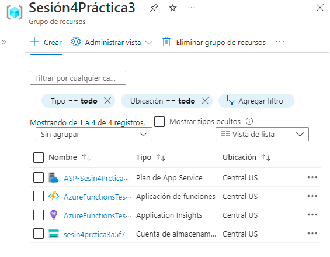
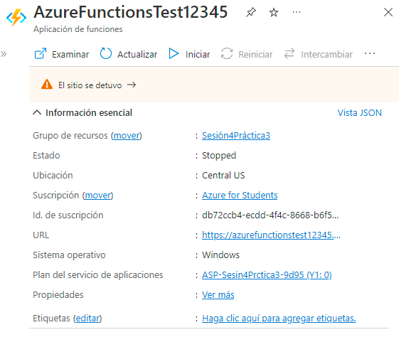
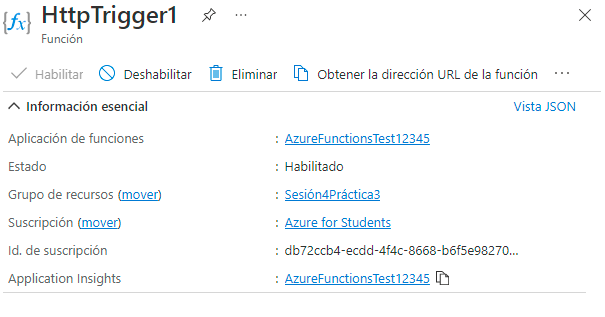
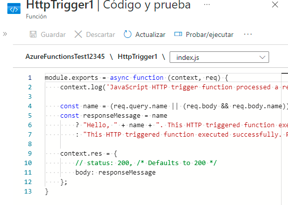
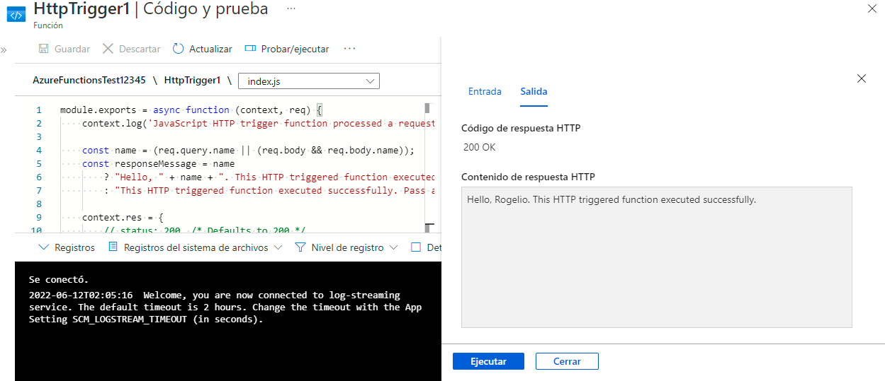

# Practica 3 Sesion4

1. Crear un grupo de recursos para Azure Functions.

2. Al generar un recurso Functions hay que dirigirse a la ventana de funciones y crear una función para lo que se desea ejecutar.

3. En este caso se realizó una función para hacer una conección API mediante scripts en JSON y proceder a realizar las pruebas.

Resultado:
-

#
Autor: Rogelio Clemente Balderas
Programa Inovaccion Virtual 

Requisitos: 
-
- Cuenta y licencia Azure.
- Azure Functions Services.
#